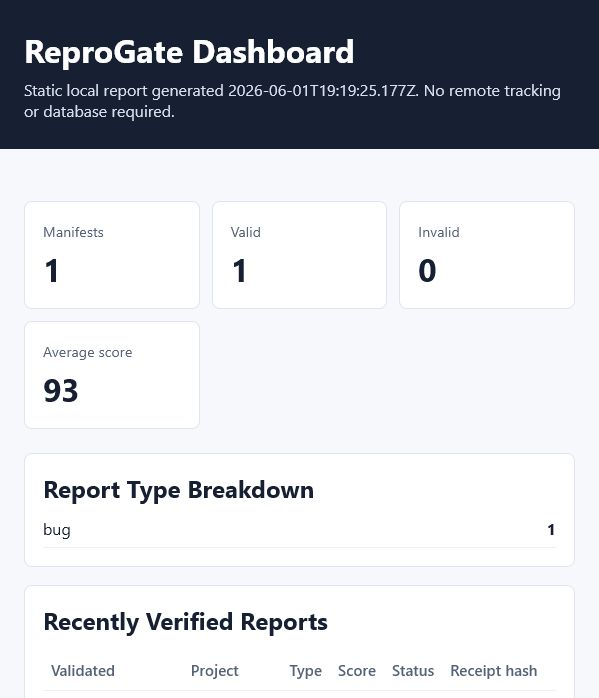

# ReproGate live demo

This repository demonstrates ReproGate running on real GitHub issues.

## What to inspect

- Incomplete issue: [#1 - missing reproduction details](https://github.com/gietsmaximiliano-pixel/reprogate-demo/issues/1)
- Complete issue: [#2 - widget title truncation](https://github.com/gietsmaximiliano-pixel/reprogate-demo/issues/2)

The ReproGate workflow validates fenced `reprogate` YAML blocks, comments with an actionability score, and applies one of these labels:

- `reprogate:complete`
- `reprogate:needs-info`
- `reprogate:manual-review`

## Dashboard

The CLI-generated dashboard shows the accepted report receipt:

## Video

Short walkthrough:

Download the MP4 version: [assets/reprogate-demo.mp4](assets/reprogate-demo.mp4)

## Verified live behavior

- Issue #1 received `reprogate:needs-info`.
- Issue #1 Action comment listed missing `actualBehavior`, `environment`, `expectedBehavior`, and `stepsToReproduce`.
- Issue #2 received `reprogate:complete`.
- Issue #2 Action comment scored the report `93/100`.
- Both workflow runs completed successfully.
